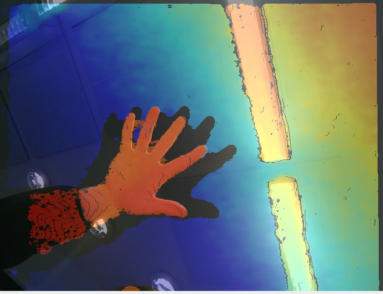
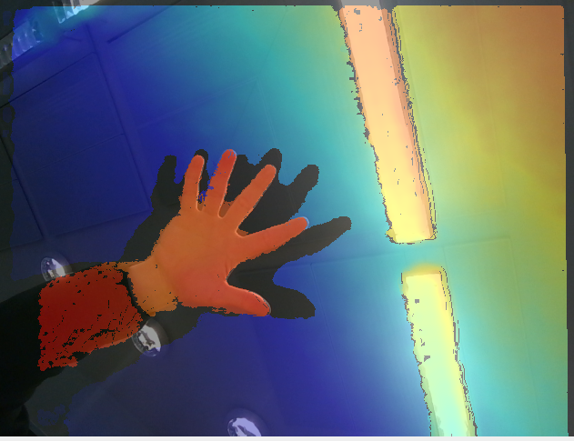
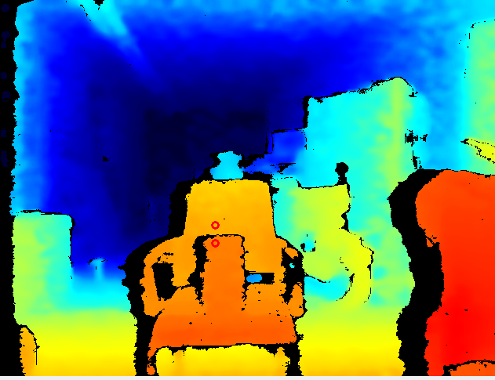
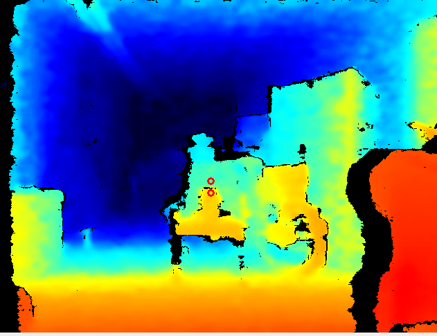
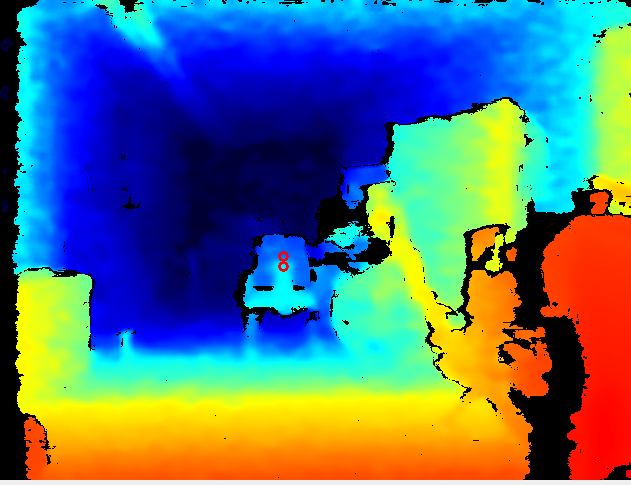

## Preview camera image
https://github.com/realsenseai/librealsense/releases

## Code used to get camera data
https://github.com/XuanKyVN/intel-realsens-camera-with-Python-YoloV11

### Before filters

### After filters

## Measuring depth accuracy
### Short range (Box distance: 1m)

* Reading: 0.41 - 0.43 meters
* Actual: 0.42 meters

### Mid range (Box distance: 2m)

* Reading: 0.40 - 0.45 meters
* Actual: 0.41 meters

### Long range (Box distance: 3m)

* Reading: 0.29 - 0.42 meters
* Actual: 0.42 meters
