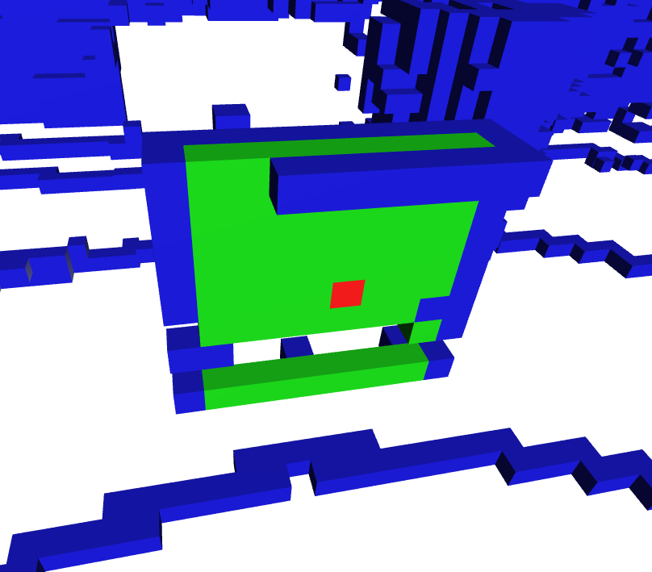
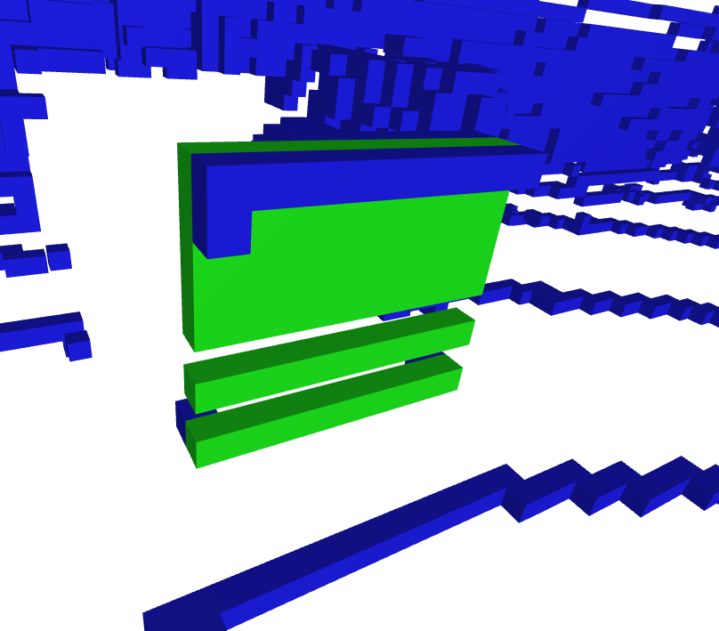
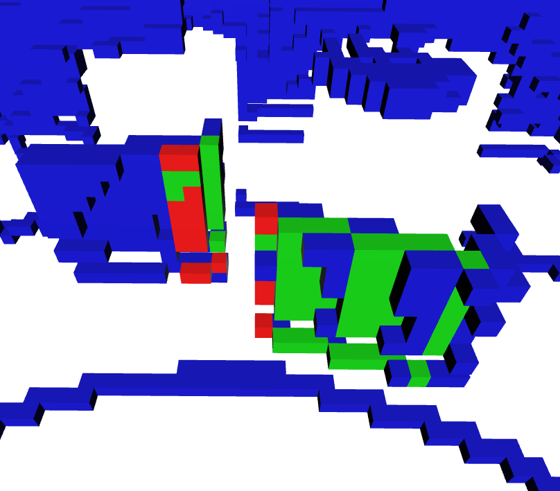
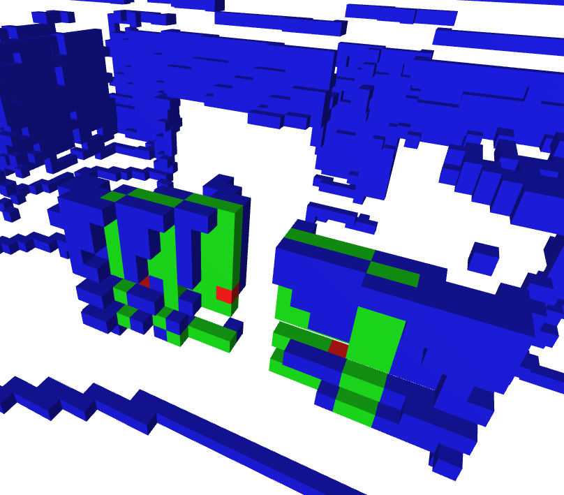
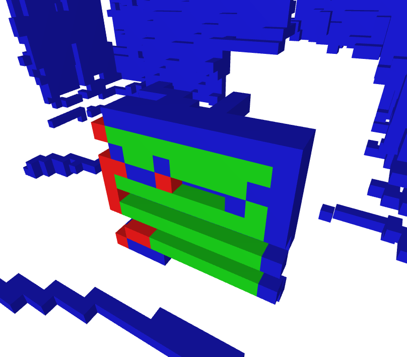
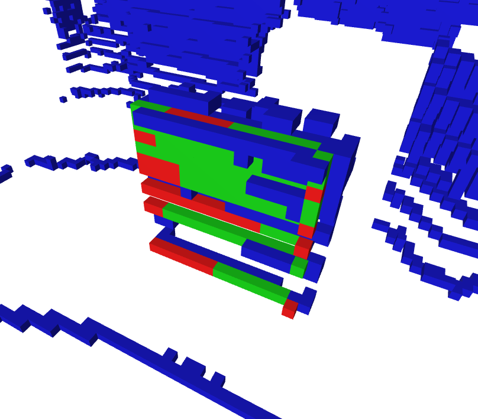
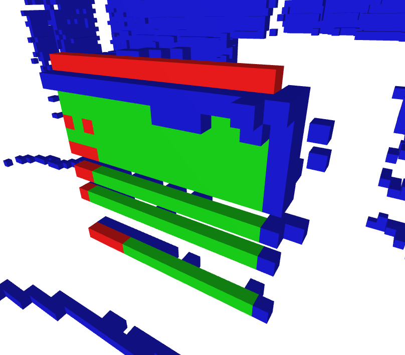
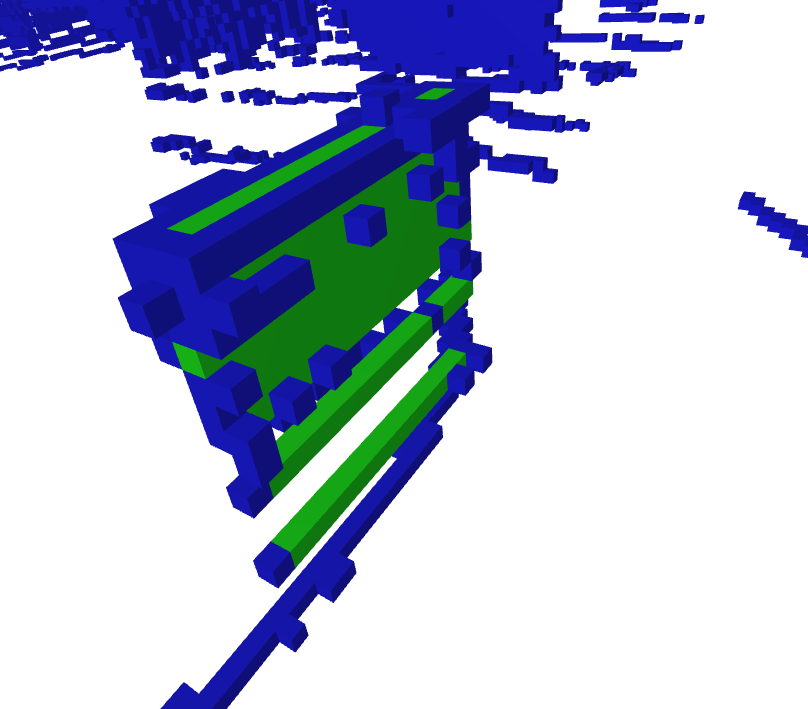

# Explanation of the pipeline

## Demo

* Red: LiDAR
* Blue: Depth camera
* Green: Estimated LiDAR points based on Depth Camera

## LiDAR position detection
Using an ArUco marker on the top of the LiDAR, we can detect its position, and with the help of depth data, we can get the LiDAR's exact 3D position relative to the camera.

1. Detect marker in screen space
2. Sample detph data $(d)$ at the center of the marker $(u, v)$
3. Convert to 3D coordinates

$$
\begin{aligned} 
z &= \frac{d}{1000} \\
x &= \frac{(u - c_x) z}{f_x} \\
y &= \frac{(v - c_y) z}{f_y}
\end{aligned}
$$

Where $f$ represents the focal length and $c$ represents the principal point from the camera intrinsics.

In addition to this, we get the markers yaw rotation relative to the camera and save it for the next step.

$$
\psi = \mathrm{atan2}(y_1 - y_0, x_1 - x_0)
$$

Where $(x_0, y_0)$ is the top-left corner and $(x_1, y_1)$ is the top-right corner.

## Get pointcloud from camera depth data
1. Using the depth data from the camera, we generate a 3D pointcloud. For every pixel, we use the above mentioned formula to convert each point to 3D space.
2. Filter invalid points that are either too close or too far away
3. Remove ground plane points

$$
z_{\text{ground}} = z_{\text{lidar}} + H_{\text{lidar}} - \text{offset}_z - \epsilon
$$

## Transformation logic
1. Roate camera points (flip $y$ and $z$ axes)

$$
\mathbf{R}_{\text{cam\\_to\\_lidar}} = \begin{bmatrix} 
1 & 0 & 0 \\ 
0 & -1 & 0 \\ 
0 & 0 & -1 
\end{bmatrix}
$$

2. Translate

$$
\mathbf{t} = \mathbf{R}_{\mathrm{cam\\_to\\_lidar}} \times \mathbf{P}_{\text{lidar}}
$$
$$
\mathbf{P}_{\text{pcd}} \leftarrow \mathbf{P}_{\text{pcd}} - \mathbf{t}
$$

3. Apply rotation to camera points

$$
\mathbf{R}_{yaw} = \begin{bmatrix} 
\cos(\psi) & -\sin(\psi) & 0 \\ 
\sin(\psi) & \cos(\psi) & 0 \\ 
0 & 0 & 1 
\end{bmatrix}
$$

## Box detection
1. Downsample depth pointcloud for performance (1cm voxelized)
2. Cluster points using Open3D's `cluster_dbscan`
3. For each cluster, find the heighest point, then discard every point below a certain threshold (10cm), so only the top of the box remains in the cluster

$$
P_z < Z_{top} - \theta
$$

4. Project this back to 2D and fit a minimal rectangle around the pixel points

$$
u = \frac{X \cdot f_x}{Z} + c_x
$$
$$
v = \frac{Y \cdot f_y}{Z} + c_y
$$

5. Project the 4 corners of the rectangle back to 3D, so we get the top face of the box

$$
X_w = \frac{(p_x - c_x) Z_{top}}{f_x}
$$
$$
Y_w = \frac{(p_y - c_y) Z_{top}}{f_y}
$$

### Sidewall generation
We assume the sidewalls to be vertical. We triangulate the space between the detected top plane and the calculated floor plane
* For each corner $i \in \{0, 1, 2, 3\}$, the bottom vertices are derived from the top vertices by substituting the floor depth:

$$P_{i, \text{bottom}} = [X_{i, \text{top}}, Y_{i, \text{top}}, Z_{\text{floor}}]$$

* For each side we have two triangles:

$$
\begin{aligned}
T_1 &= [P_{i, \text{top}}, P_{i+1, \text{top}}, P_{i+1, \text{bottom}}]
\\
T_2 &= [P_{i, \text{top}}, P_{i, \text{bottom}}, P_{i+1, \text{bottom}}]
\end{aligned}
$$

* Finally, each triangle is processed to guarantee its normal vector points outward from the box center:

$$
\begin{aligned}
\mathbf{n} &= (\mathbf{v}_1 - \mathbf{v}_0) \times (\mathbf{v}_2 - \mathbf{v}_0)
\\
\mathbf{v}_{out} &= \text{centroid}_{tri} - \text{center}_{box}
\\
\text{If} \ & \ \mathbf{n} \cdot \mathbf{v}_{out} < 0 \to \text{flip normal}
\end{aligned}
$$

## Point generation
After having a list of triangles, we are ready to generate the occluded LiDAR points. We perform a ray-triangle intersection test for every LiDAR ray against each triangle.

1. Near-Field Culling: get rid of invalid triangles that are too close to the LiDAR

$$
\|\text{centroid}_{tri} - \mathbf{P}_{lidar}\| > d_{min}
$$

2. Transform triangles to world space using the same transformation logic mentioned above (triangle detection runs in camera space)
3. Run Möller–Trumbore

$$
\mathbf{\hat{d}}_i = \frac{\mathbf{P}_i - \mathbf{O}}{\|\mathbf{P}_i - \mathbf{O}\|}
$$

4. Sort the hits by distance from the origin, then discard the one closest to the LiDAR (the LiDAR sees this point by itself; it's not occluded)

## Evaluation
We voxelize both the LiDAR pointcloud and the predicted pointcloud.

$$
\text{Precision} = \frac{Correctly\ generated}{All\ generated}
$$

$$
\text{ADE} = \frac{1}{N} \sum_{i=1}^{N} \min_{\mathbf{g} \in \mathbf{P}_{gt}} \| \mathbf{p}_i - \mathbf{g} \|
$$

$$
\text{MDE} = \max_{i} \left( \min_{\mathbf{g} \in \mathbf{P}_{gt}} \| \mathbf{p}_i - \mathbf{g} \| \right)
$$

## Some examples

### Example 1

```
Voxel size:      5cm
Green (Hits):    55
Red (False Pos): 1
Precision:       98.21%
```
**Note:** The Recall on this would show that we missed both sides of the box by one voxel

### Example 2

```
Voxel size:      5cm
Green (Hits):    70
Red (False Pos): 0
Precision:       100.00%
```

### Example 3
A more complex scene, containing two boxes, one being only partially occluded (left).

```
Voxel size:      5cm
Green (Hits):    67
Red (False Pos): 20
Precision:       77.01%
```

### Example 4
Another complex scene, both boxes are partially occluded.

```
Voxel size:      5cm
Green (Hits):    92
Red (False Pos): 3
Precision:       96.84%
```

### Example 5
In this example, it's clearly visible that most of the error is due to the yaw-rotational inaccuracy of the alignment.

```
Voxel size:      5cm
Green (Hits):    41
Red (False Pos): 10
Precision:       80.39%
```

### Example 6

```
Voxel size:      3cm
Green (Hits):    96
Red (False Pos): 39
Precision:       71.11%
```

### Example 7
Here it's clearly visible that the error was caused by height mismatch.

```
Voxel size:      3cm
Green (Hits):    123
Red (False Pos): 27
Precision:       82.00%
```

### Example 8

```
Voxel size:      3cm
Green (Hits):    127
Red (False Pos): 0
Precision:       100.00%
```

## Reason for the errors
### Rotational inaccuracy
As seen in Example 5, the rotational (yaw)alignment of the LiDAR and camera pointclouds couses inaccuracies. This is caused by the instable detection of the ArUco marker on top of the LiDAR. The marker is relatively far away form the camera, so it takes up a very small part of the image (around 20-30 pixels). This caueses detection instabilities. At this scale, a single pixel difference in the detection applies mulitple degrees of yaw rotation to the camera pointcloud, resulting in slight misalignment between it and the LiDAR pointcloud.

In the following picture the tiny bit of rotational inaccuracy is visible by looking at the bottom right box.

* Red: LiDAR
* Blue: Depth camera

### Depth noise
The box detection relies on clustering. If some noisy points find their way inside a cluster, the smallest bounding rectangle algorithm "stretches" the rectangle to fit these noisy points too, resulting in the box being larger than it needs to be.

### Box detection problems
The depth values of the camera tend to be inaccurate at the edge of a box. If the camera doesn't see the box directly from the top but from a perspective, it samples depth values from the side of the box too. The transition from the top face of the box to the side face is not a sharp edge but a slight curve. The points "bend down" towards the edge instead of forming a well distinguishable edge.

### Alignment inaccuracy
The depth detecton of the ArUco marker is also marginally inaccuare. It has been tested that the depth camera gets slightly inaccuare at 2-3 meters. The $(x, y)$ position detection is also a tiny bit inaccurate (sub pixel inaccuracy). All these errors get carried through the entire pipeline, resulting in box detection and point generation inaccuracies.
