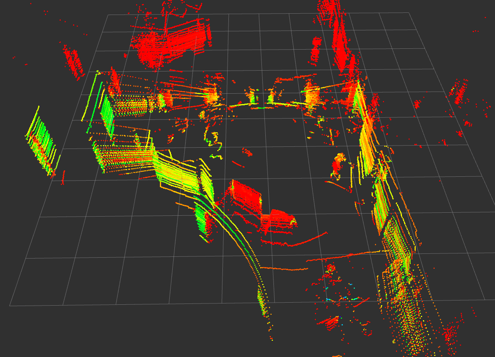

## ROS installation for LiDAR data decoding
### Add ROS repository
```bash
sudo curl -sSL https://raw.githubusercontent.com/ros/rosdistro/master/ros.key \
  -o /usr/share/keyrings/ros-archive-keyring.gpg
```

```bash
echo "deb [signed-by=/usr/share/keyrings/ros-archive-keyring.gpg] \
http://packages.ros.org/ros2/ubuntu \
$(. /etc/os-release && echo $UBUNTU_CODENAME) main" | \
sudo tee /etc/apt/sources.list.d/ros2.list > /dev/null
```

### Import ROS
```bash
sudo apt update
sudo apt install ros-humble-desktop

source /opt/ros/humble/setup.bash
echo "source /opt/ros/humble/setup.bash" >> ~/.bashrc
```

### Install drivers for LiDAR
```bash
sudo apt install ros-humble-velodyne
```

Check if successful:
```bash
ros2 topic list
```

### Edit IP address of LiDAR
```bash
sudo nano /opt/ros/humble/share/velodyne_driver/config/VLP32C-velodyne_driver_node-params.yaml
```

### Run driver
```bash
ros2 launch velodyne velodyne-all-nodes-VLP32C-launch.py
```

### Run visualizer
```bash
rviz2
```
Add PointCloud2 from topic `/velodyne_points`

### Result
